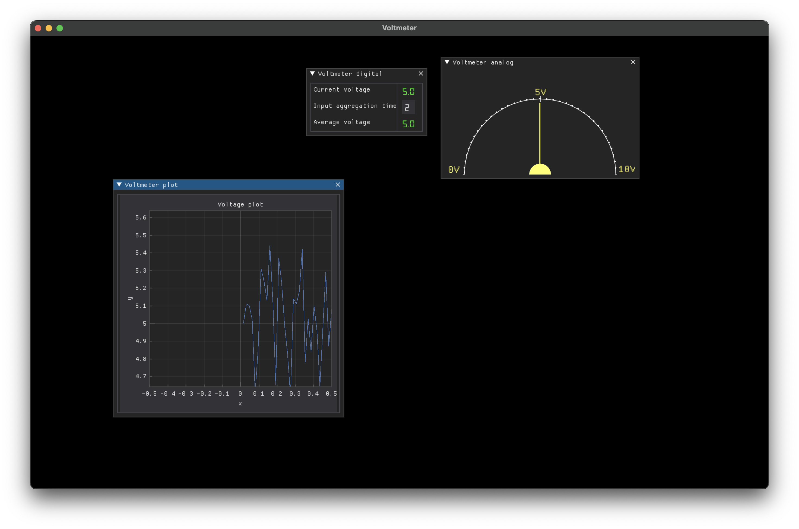

# Simulator Voltmeter

## Задание

Создать пользовательский интерфейс вольтметра, который показывает напряжение в текущий момент времени (период обновления порядка десятков миллисекунд), напряжение среднее за указанных промежуток времени (период задаёт пользователь, минимум 1 секунда).

Для получения значений напряжения можно использовать микроконтроллер и его вход АЦП (за это дополнительные баллы), но если нет такой возможности, то использовать генератор чисел по нормальному распределению относительно некоторого стандартного значения (3.3, 5, 12, 24, 230 Вольт).

Для взаимодействия с заказчиком, разбиться на пары, где один — заказчик, другой исполнитель и наоборот.

Оценивается:
- качество интерфейса с точки зрения юзабилити, наличия ошибок, адекватности и понятности представления данных;
- методика создания интерфейса (ваши черновики и рисунки тоже имеют значение);
- качество кода, скорость работы программы.

Цель задания:
- закрепить теоретический материал по проектированию интерфейсов;
- получить навыки создания динамически изменяющихся интерфейсов;
- попробовать работу с выводом графических элементов, используя фреймворк DearPyGui.

Если для итогового варианта хотите использовать свой фреймворк, то:
- как минимум базовый функционал реализовать с помощью DPG;
- приложить подробную инструкцию для запуска вашего ПО без DPG под Windows, лучше просто готовый исполняемый файл.

## Демонстрация

